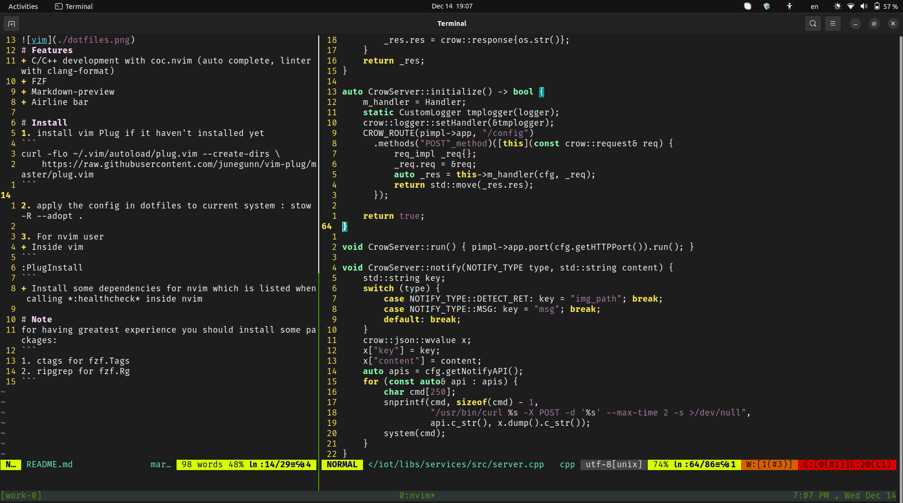

# Features: configuration for below softwares
+ [oh-my-zsh](https://github.com/ohmyzsh/ohmyzsh)
+ [tmux](https://github.com/tmux/tmux/wiki)
+ [(n)vim](https://neovim.io/)
  - C/C++ development with coc.nvim (auto complete, linter with clang-format)
  - FZF
  - Markdown-preview
  - Airline bar

# Install
## Zsh
Follow the above link to install oh-my-zsh with a command;
## Tmux
Follow the above link to install tmux with a command;
## Vim
1. install vim Plug if it haven't installed yet
```
curl -fLo ~/.vim/autoload/plug.vim --create-dirs \
    https://raw.githubusercontent.com/junegunn/vim-plug/master/plug.vim
```
    

3. For nvim user 
+ Inside vim
```
:PlugInstall
```
+ Install some dependencies for nvim which is listed when calling *:healthcheck* inside nvim

## Apply the config
If you want to keep your configuration files, let *move* it to dotfiles folder then use below command.  
`stow -R --adopt . -t ${HOME} -v`
# Note
+ ##### This is only configurations for the softwares therefore the precondition is the softwares were installed
+ For having greatest experience you should install some packages:
```
1. ctags for fzf.Tags
2. ripgrep for fzf.Rg
```
+ For C/C++ autocomplete you need *compile_command.json* to seach definition/references correctly
